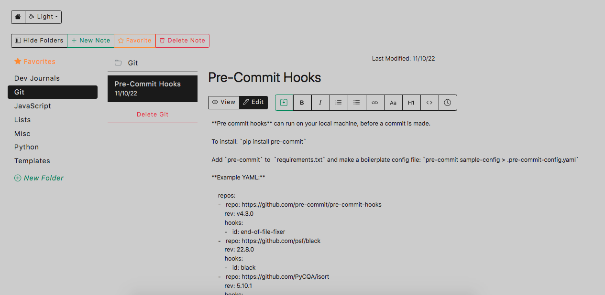

# Markdown Lab
---

Minimalist markdown text editor, running in any web browser of your choice. Powered by Flask and JS. Also inspired by [archivy](https://github.com/archivy/archivy).

## Features
- Organize your folders and markdown notes in any directory you choose
- Save your favorite notes for quicker access
- Save `txt` files (called Memos) to the same folder for easier access from a wider range of devices
- Features WYSIWYG text editor with a large set of formatting options inlcuding capitalization, images, and code blocks
- Has vertical and horizontal navbar, depending on user preference

## Installation / Usage
1. Clone this repo
2. Run `python3 setup.py develop` command in working directory
3. Set config variables in `.env`:

        home_dir (directory of your choice)
        debug=['true','false']
        env=['production', 'development']
        port=[4-digit number string]

4. Run `mdlab` command
